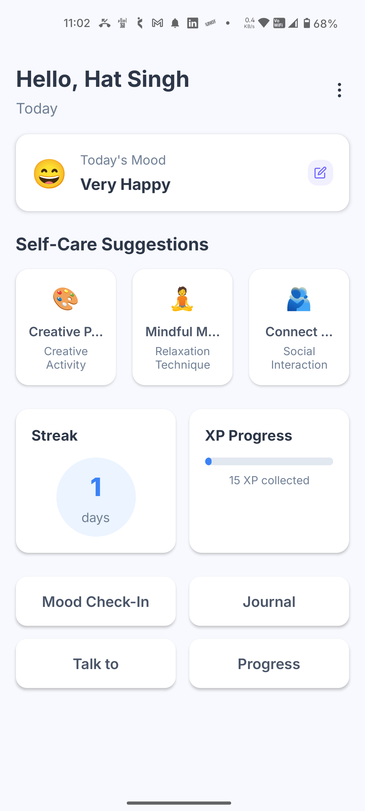
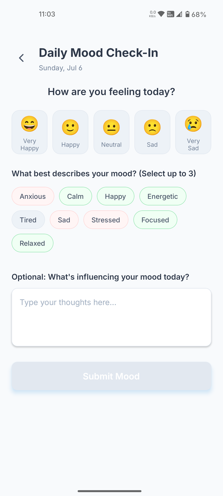
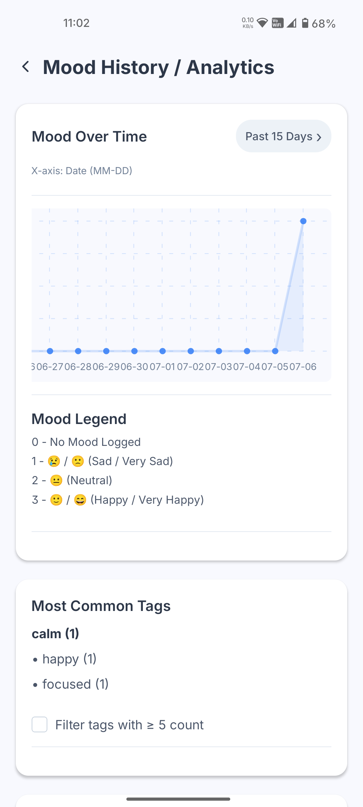
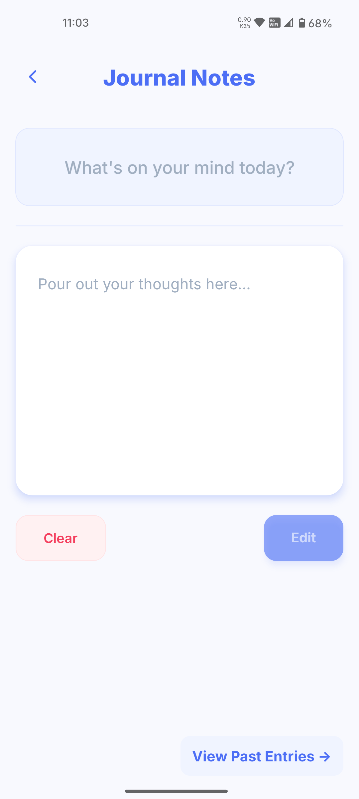
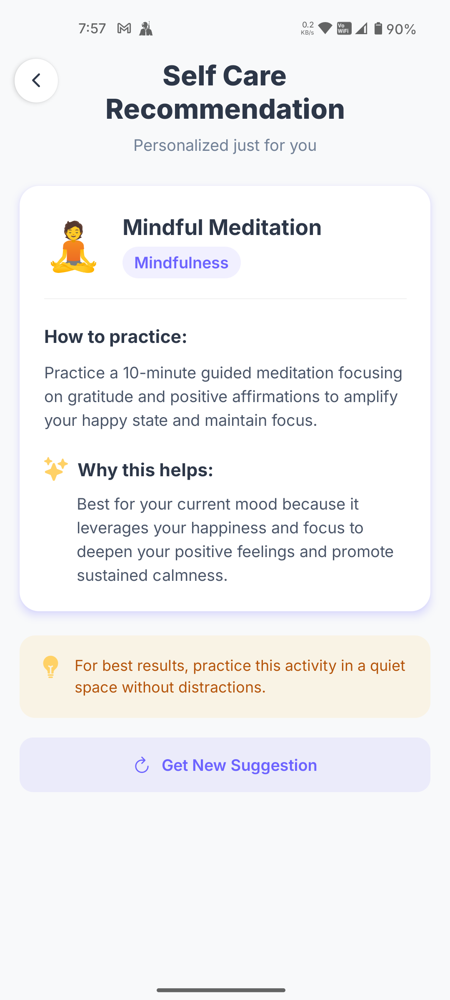
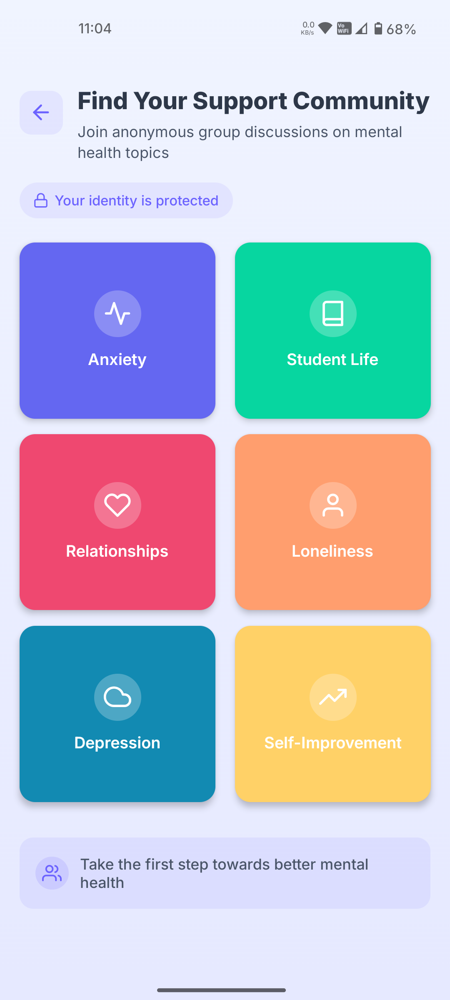
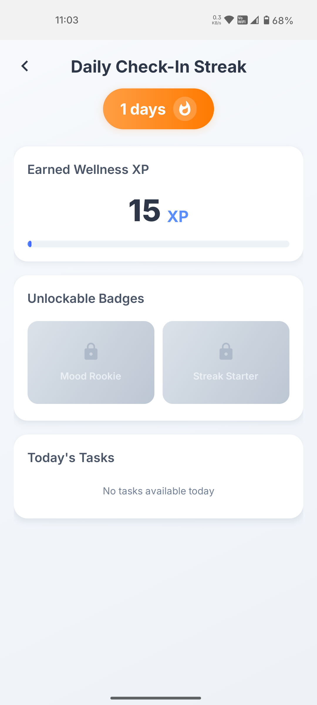
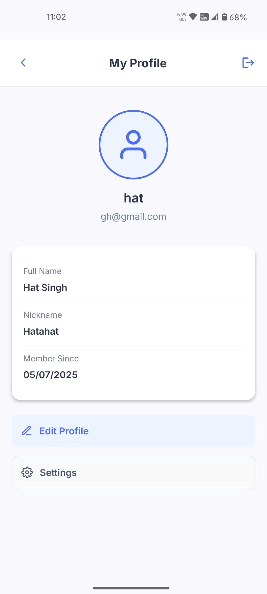
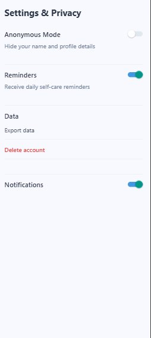

# 🧠 MindMate - Mental Wellness Companion

[](https://expo.dev/)
[](https://reactnative.dev/)
[](LICENSE)


## 📱 App Screens

### Core Features
<div style="display: grid; grid-template-columns: repeat(2, 1fr); gap: 10px; margin: 10px 0;">
    
  <div>
    
    <p><strong>Home</strong></p>
  </div>
  <div>
    
    <p><strong>Mood Tracking</strong></p>
  </div>
  <div>
    
    <p><strong>Mood History</strong></p>
  </div>
  <div>
    
    <p><strong>Journaling</strong></p>
  </div>
  <div>
    
    <p><strong>AI Recommendations</strong></p>
  </div>
</div>

### Community & Progress
<div style="display: grid; grid-template-columns: repeat(2, 1fr); gap: 10px; margin: 10px 0;">
  <div>
    
    <p><strong>Support Groups</strong></p>
  </div>
  <div>
    
    <p><strong>Progress Tracking</strong></p>
  </div>
  <div>
    
    <p><strong>User Profile</strong></p>
  </div>
  <div>
    
    <p><strong>Privacy Settings</strong></p>
  </div>
</div>

## ✨ Key Features
- **Daily Mood Check-Ins** with emotional tagging
- **Journaling System** with rich text entries
- **AI-Powered Self-Care Recommendations**
- **Wellness Gamification** (XP & Badges)
- **Anonymous Support Communities**
- **Comprehensive Mood Analytics**

## 🛠 Tech Stack
- **Framework**: React Native + Expo
- **State Management**: Redux Toolkit
- **UI Kit**: React Native Paper
- **Navigation**: React Navigation 6
- **Charts**: React Native SVG Charts
- **Authentication**: Firebase Auth

## 🚀 Getting Started

### Prerequisites
- Node.js 18+
- Expo CLI (`npm install -g expo-cli`)
- Android/iOS simulator or device

### Installation
```bash
git clone https://github.com/rath23/mindmate-app.git
cd mindmate-frontend
npm install
